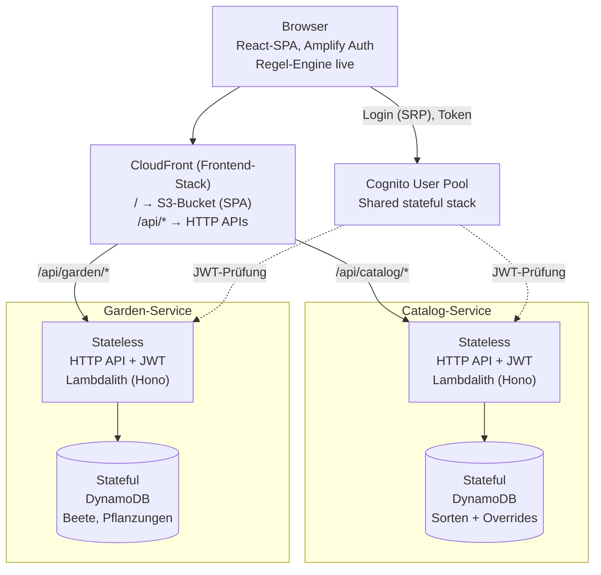

# Hochbeet-Planer – Architektur & Domänenmodell

Stand: 7. Oktober 2026

## Überblick

Der Hochbeet-Planer ist eine Web-App, in der angemeldete User ihre Hochbeete maßstabsgetreu planen und über die Zeit bepflanzen. Die App warnt bei zu geringem Pflanzabstand, schlechten Nachbarn, benachbarten Starkzehrern und Fruchtfolge-Fehlern, lässt das Speichern aber immer zu.

Rahmenbedingungen:

- Spaßprojekt, zunächst nur die Umgebung `prod`; `dev` kann später ergänzt werden.
- Ein GitHub-Monorepo, durchgängig TypeScript für Frontend, Backend und IaC.
- Komplett serverless auf AWS, Kosten im Leerlauf nahe null.
- Desktop und Mobile sind gleichwertige Zielplattformen.
- Login per E-Mail und Passwort über Cognito; Google-Login kann später folgen.
- Umsetzungsaufgaben liegen als GitHub-Issues vor (Label `task`, Epics mit Label `epic`).

## Domänenmodell

Das Modell kennt drei Kernobjekte: das Beet, die Pflanzung und die Sorte. Alle Längen sind in Zentimetern angegeben. Positionen liegen auf einem 5-cm-Raster, dessen Ursprung die linke obere Ecke des Beets ist.

### Bed (Hochbeet)

| Feld | Typ | Bedeutung |
| --- | --- | --- |
| `id` | ULID | Eindeutige ID |
| `name` | string | Anzeigename |
| `widthCm` | number | Breite des Beets |
| `depthCm` | number | Tiefe des Beets |
| `mainRowDirection` | `H` \| `V` | Reihenrichtung des Beets, pro Beet wählbar; Standard parallel zur kürzeren Kante, also Reihen quer übers Beet (z. B. 1 m lang in einem 2 × 1 m Beet) |
| `soilRenewals` | Datum[] | Zeitpunkte „Erde erneuert“; setzen die Fruchtfolge zurück (Standard: jährlich 1. März) |

### Planting (Pflanzung)

| Feld | Typ | Bedeutung |
| --- | --- | --- |
| `id` | ULID | Eindeutige ID |
| `bedId` | ULID | Zugehöriges Beet |
| `plantId` | ULID | Verweis auf die Sorte |
| `kind` | `SINGLE` \| `ROW` | Einzelpflanze oder Reihe |
| `x`, `y` | number | Position in cm, Vielfaches von 5; bei Reihen der Startpunkt |
| `orientation` | `H` \| `V` | Nur Reihen: parallel zur Breite oder zur Tiefe; vorbelegt mit der Reihenrichtung des Beets |
| `lengthCm` | number | Nur Reihen: Länge in 5er-Schritten |
| `startDate` | ISO-Datum | Pflanzdatum, immer der Montag der gewählten Woche |
| `endDate` | ISO-Datum \| null | Aus dem Lebenszyklus vorbelegt, pro Pflanzung überschreibbar; leer bei Dauerkulturen |
| `removedDate` | ISO-Datum \| null | Manuelles Entfernen „ab KW XY“; sticht `endDate` |

Die Stückzahl einer Reihe wird nicht gespeichert, sondern berechnet: `floor(lengthCm / Pflanzabstand) + 1`.

### Plant (Sorte)

| Feld | Typ | Bedeutung |
| --- | --- | --- |
| `id` | ULID | Bleibt auch bei Publikation gleich |
| `name` | string | z. B. „Kopfsalat“ |
| `category` | `GEMUESE` \| `OBST` \| `KRAUT` | Kategorie |
| `family` | string | Pflanzenfamilie, z. B. Kreuzblütler; Basis der Fruchtfolge |
| `feeder` | `STARK` \| `MITTEL` \| `SCHWACH` | Nährstoffbedarf |
| `spacingInRowCm` | number | Pflanzabstand in der Reihe |
| `rowSpacingCm` | number | Reihenabstand |
| `lifecycle` | Union, siehe unten | Wie lange die Pflanze im Beet bleibt |
| `goodNeighbors` | plantId[] | Gute Nachbarn (symmetrisch ausgewertet) |
| `badNeighbors` | plantId[] | Schlechte Nachbarn (symmetrisch ausgewertet) |
| `color` | string | Farbe der Standfläche im Beet-Editor |
| `icon` | string | Schlüssel eines SVG-Icons aus `packages/plant-icons`; eigene Sorten wählen ein vorhandenes Icon oder bekommen das Kategorie-Icon |

Der Lebenszyklus hat drei Varianten:

- `ANNUAL` mit `cultureWeeks`: Ende = Pflanzdatum + Kulturdauer.
- `MULTI_YEAR` mit `years`: Ende = Pflanzdatum + Jahre, z. B. Erdbeere mit 3 Jahren.
- `PERENNIAL`: kein Ende, z. B. Rosmarin; nur manuelles Entfernen.

### Standfläche

Jede Pflanzung hat eine Standfläche, die alle Regeln einheitlich macht und im Editor halbtransparent gezeigt wird.

- Einzelpflanze: Kreis um `(x, y)` mit Radius `spacingInRowCm / 2`.
- Reihe: Streifen entlang der Reihe mit Breite `rowSpacingCm`, an den Enden je `spacingInRowCm / 2` überstehend.

Die **Lücke** zwischen zwei Pflanzungen ist der kürzeste Abstand zwischen ihren Standflächen. Überlappen sie, ist die Lücke negativ; ihr Betrag ist die Eindringtiefe. Berühren sie sich nur, ist die Lücke 0.

Umsetzung in `packages/garden-rules` (`geometry.ts`):

- Der Streifen einer Reihe ist ein achsenparalleles Rechteck. Bei `orientation: H` reicht er von `x − Abstand/2` bis `x + lengthCm + Abstand/2` und quer dazu `y ± rowSpacingCm/2`, bei `V` mit vertauschten Achsen.
- Eine Standfläche belegt eine **Rasterzelle**, wenn sich ihre Flächen überschneiden; bloßes Berühren zählt nicht. Zelle `(col, row)` umfasst `[5·col, 5·col + 5) × [5·row, 5·row + 5)`. Eine Einzelpflanze auf einem Rasterpunkt belegt damit immer mindestens vier Zellen.
- Abstände (`spacingInRowCm`, `rowSpacingCm`) sind ganze Zentimeter, aber nicht an das 5-cm-Raster gebunden, weil die Quellen Werte wie 7 cm nennen. Das Raster gilt nur für Positionen, Längen und Beetmaße.
- Standard-Reihenrichtung eines neuen Beets: `V`, wenn das Beet mindestens so breit wie tief ist, sonst `H`.

## Regel-Engine

Alle Warnungen werden von einer reinen TypeScript-Bibliothek `packages/garden-rules` berechnet und nie gespeichert. Warnungen blockieren das Speichern nie. Sie veralten deshalb auch nicht, wenn eine Sorte angepasst wird.

Alle Regeln außer der Fruchtfolge gelten nur zwischen Pflanzungen, deren Zeiträume sich überlappen. Der Einflussradius für Nachbarschaft und Starkzehrer beträgt 30 cm und ist als Konstante zentral konfigurierbar.

| Regel | Bedingung | Stufe |
| --- | --- | --- |
| Pflanzabstand | Standflächen zweier Pflanzungen überlappen (Lücke < 0) | Warnung |
| Schlechte Nachbarn | Eine Sorte steht in `badNeighbors` der anderen und die Lücke ist < 30 cm | Warnung |
| Gute Nachbarn | Eine Sorte steht in `goodNeighbors` der anderen, keine Seite markiert das Paar als schlecht, und die Lücke ist < 30 cm | Positiver Hinweis |
| Starkzehrer | Beide sind `STARK`, stehen quer zur Reihenrichtung nebeneinander und die Lücke ist < 30 cm; hintereinander in Reihenrichtung nie | Warnung |
| Fruchtfolge | Auf mindestens einer Rasterzelle gehört der direkte Vorgänger zur selben Familie, und dazwischen wurde die Erde nicht erneuert | Warnung |
| Beetrand | Standfläche ragt über den Beetrand | Dezenter Hinweis |

### Details

**Warnung sticht:** Markiert eine Seite ein Paar als schlechten Nachbarn, gilt es als schlecht, auch wenn die andere Seite es als guten Nachbarn führt. Solche Widersprüche kommen in den Quellen des Startkatalogs vor.

**Starkzehrer** werden nur quer zur Reihenrichtung geprüft. Drei Brokkoli hintereinander in einer Reihe sind erlaubt. Daneben darf aber kein weiterer Starkzehrer stehen, etwa Brokkoli oder Staudensellerie in der Nachbarreihe, solange weniger als 30 cm Lücke bleiben.

- Innerhalb einer Reihen-Pflanzung entsteht nie eine Warnung.
- Zwei Pflanzungen stehen **nebeneinander**, wenn sich ihre Standflächen entlang der Reihenrichtung überschneiden und quer dazu weniger als 30 cm Lücke liegt.
- Eine Pflanzung in Verlängerung einer Reihe, also am Kopfende, steht **hintereinander** und ist erlaubt.
- Reihenrichtung: bei Reihen ihre Orientierung, bei Einzelpflanzen die Reihenrichtung des Beets (`mainRowDirection`).
- Haben zwei Reihen unterschiedliche Orientierung, wird aus Sicht beider Reihen geprüft; eine Warnung entsteht, wenn sie aus einer Sicht nebeneinander stehen.
- Umsetzung (`rules/heavy-feeders.ts`): Aus Sicht einer Reihenrichtung stehen zwei Starkzehrer **nebeneinander**, wenn sich ihre Standflächen entlang der Reihe mit mehr als 0 cm überschneiden und quer dazu eine Lücke von mindestens 0 und unter 30 cm liegt. Überschneiden sie sich auf beiden Achsen, warnt nur die Abstandsregel; so lösen zu eng gesetzte Pflanzen derselben Reihe keine Starkzehrer-Warnung aus. Der Text nennt die kleinste gefundene Lücke.

**Fruchtfolge** wird pro 5-cm-Rasterzelle geprüft. Für jede Zelle der neuen Pflanzung wird die zuletzt dort beendete Pflanzung derselben Saison gesucht. Gehört sie zur selben Pflanzenfamilie, entsteht eine Warnung. Eine dazwischenliegende Pflanzung einer anderen Familie hebt die Warnung auf, weil dann kein direkter Nachfolger mehr vorliegt.

Umsetzung (`rules/crop-rotation.ts`): Direkter Vorgänger auf einer Zelle ist die Pflanzung, die dort zuletzt geendet hat, spätestens am Starttag der neuen; gleichzeitig stehende Pflanzungen und Dauerkulturen ohne Ende zählen nicht. Familien werden ohne Rücksicht auf Groß- und Kleinschreibung verglichen. Pro Paar aus Vorgänger und Nachfolger entsteht ein Befund mit dem Zeitraum des Nachfolgers. Weil auf Zellen gerechnet wird, reicht es, wenn beide Standflächen in dieselbe 5-cm-Zelle reichen, auch wenn sie sich nur berühren.

### Befunde und Regeln im Code

Jede Regel ist eine Funktion `(ctx: RuleContext) => Finding[]` in `packages/garden-rules/src/rules/`. `resolvePlantings()` verbindet vorher jede Pflanzung einmal mit ihrer Sorte, Standfläche und ihrem Zeitraum; Pflanzungen mit unbekannter Sorte werden übersprungen.

Ein `Finding` hat `rule`, `severity` (`WARNING`, `POSITIVE` oder `HINT`), sortierte `plantingIds`, den Zeitraum `period` und einen deutschen Text `message`. Bei Paaren ist `period` die gemeinsame Zeit beider Pflanzungen, beim Beetrand die Standzeit der Pflanzung. Geometrische Vergleiche nutzen eine Toleranz von 10⁻⁶ cm, damit sich nur berührende Standflächen nicht als überlappend gelten. In Texten zu Paaren stehen die Sortennamen alphabetisch („Kartoffel und Tomate“), damit der Befund nicht von der Reihenfolge der Pflanzungen abhängt.

Der Einflussradius (`INFLUENCE_RADIUS_CM = 30` in `constants.ts`) gilt, solange die Lücke **kleiner** als 30 cm ist; bei genau 30 cm greift die Regel nicht mehr. Gute und schlechte Nachbarn werden symmetrisch ausgewertet: Es genügt, wenn eine der beiden Sorten die andere listet.

### Schnittstelle

Die Engine erhält ein Beet, alle seine Pflanzungen und die effektiven Sorten des Users: `evaluateBed(bed, plantings, plants, { week? })`. Sie liefert eine Liste von Befunden mit Regel, Stufe, betroffenen Pflanzungs-IDs, Zeitraum und einem deutschen Anzeigetext. Optional kann man auf eine Woche filtern. Die Engine ist isomorph und läuft im Browser wie in Node.

Umsetzung (`packages/garden-rules/src/engine.ts`):

- `evaluateBed` verbindet die Pflanzungen einmal mit ihren Sorten und ruft alle Regeln auf. Die Befunde kommen in fester Reihenfolge: Warnungen, dann dezente Hinweise, dann positive Hinweise; innerhalb davon nach Regel, Pflanzungs-IDs und Zeitraum.
- Mit `week` wird trotzdem die ganze Historie ausgewertet (die Fruchtfolge braucht Vorgänger); zurück kommen nur Befunde, deren Zeitraum die ISO-Woche berührt.
- Property-Tests (fast-check) sichern zu: Das Ergebnis hängt nicht von der Reihenfolge der Pflanzungen oder Sorten ab, Nachbarlisten wirken symmetrisch, Befunde sind wohlgeformt, und der Wochenfilter liefert genau die passende Teilmenge.
- Leistung: 200 Pflanzungen in einem 6 × 3 m Beet über zwei Saisons brauchen im Median etwa 15 ms (Vorgabe: unter 50 ms; `engine.perf.test.ts`). Die Fruchtfolge nutzt dafür einen Zellindex mit kleinen ganzzahligen Schlüsseln und prüft Familie und Erneuerung nur einmal pro Paar.

## Zeitmodell

Geplant wird in Wochen, angezeigt werden aber echte Daten: Im UI steht „30. März – 5. April 2026“ im Vordergrund, die KW nur klein daneben. Intern werden ISO-Datumswerte gespeichert, Wochen folgen ISO-8601 (Montag bis Sonntag), gerechnet wird mit date-fns.

- **Wochen-Slider** über jedem Beet, beschriftet mit Monatsnamen. Er zeigt, was in der gewählten Woche im Beet steht. Vorgänger und Nachfolger an derselben Stelle erscheinen als blasse „Geister“.
- **Einjährige Sorten** enden nach Pflanzdatum plus Kulturdauer; das Ende ist pro Pflanzung anpassbar.
- **Erdbeeren** (`MULTI_YEAR`, 3 Jahre) bleiben automatisch drei Jahre im Beet, außer sie werden vorher entfernt.
- **Dauerkulturen** wie Rosmarin bleiben unbegrenzt, bis man „Entfernen ab …“ wählt.
- **Entfernen** setzt `removedDate` auf den Montag der gewählten Woche. Die Pflanzung bleibt in der Historie sichtbar und zählt für die Fruchtfolge.

Umsetzung in `packages/garden-rules` (`time.ts`):

- **Zeitraum einer Pflanzung:** halboffen `[Start, Ende)`. Das Ende ist der erste Tag, an dem die Pflanzung nicht mehr im Beet steht; endet eine Pflanzung am Montag, an dem die nächste beginnt, überlappen sie nicht. Kein Ende heißt unbegrenzt.
- **Effektives Ende:** `removedDate` vor `endDate` vor dem Lebenszyklus (`ANNUAL`: Start + Kulturwochen, `MULTI_YEAR`: Start + Jahre, `PERENNIAL`: kein Ende). `removedDate` gewinnt auch, wenn es nach dem geplanten Ende liegt.
- **Woche:** ISO-8601, Montag bis Sonntag. Eine Pflanzung ist in einer Woche sichtbar, wenn sie an mindestens einem Tag der Woche im Beet steht.
- **Anzeige:** `formatWeek()` liefert „30. März – 5. April 2026 · KW 14“; Frontend und Regeln nutzen dieselbe Funktion.

### Saisongrenze

Die Fruchtfolge gilt nur innerhalb einer Saison, weil jedes Jahr neue Erde aufgefüllt wird. Jedes Beet hat Ereignisse „Erde erneuert am …“, und eine Fruchtfolge-Warnung entsteht nur, wenn zwischen dem Ende des Vorgängers und dem Start des Nachfolgers keine Erneuerung liegt.

- Ohne eigenen Eintrag gilt jedes Jahr der 1. März als Erneuerung. Das gilt **pro Jahr**: Hat ein Beet für ein Jahr eigene Daten, ersetzen sie dort den 1. März; alle anderen Jahre behalten den Standard.
- Eine Erneuerung zählt, wenn sie zwischen dem Ende des Vorgängers und dem Start des Nachfolgers liegt, beide Tage eingeschlossen.
- Der User kann das Datum pro Beet setzen oder verschieben, etwa wenn Knoblauch über den Winter steht.
- Dauerkulturen und Erdbeeren stehen über eine Erneuerung hinweg einfach weiter.

## Pflanzenkatalog

Jeder User sieht eine effektive Sicht aus drei Quellen: globale Sorten, eigene Sorten und persönliche Anpassungen. Nur eigene Sorten können zur Publikation angefragt werden.

| Quelle | Wer pflegt | Sichtbar für | Publizierbar |
| --- | --- | --- | --- |
| Globale Sorte | Admin | Alle | – (bereits global) |
| Eigene Sorte | Der User selbst | Nur den User | Ja, per Anfrage |
| Persönliche Anpassung | Der User selbst | Nur den User | Nein |

### Persönliche Anpassungen

Eine Anpassung ist ein Overlay auf eine globale Sorte: effektive Sorte = `{...global, ...override}`. Anpassbar sind alle fachlichen Felder, auch Abstände und Nachbarlisten. Angepasste Sorten sind im UI markiert und lassen sich auf den globalen Stand zurücksetzen.

### Publikations-Workflow

1. Der User legt eine eigene Sorte an (Status `PRIVATE`).
2. Er fragt die Publikation an (Status `PENDING`); die Sorte bleibt für ihn weiter nutzbar.
3. Der Admin prüft die Anfrage in einer Warteschlange und kann Werte vor der Freigabe korrigieren.
4. Bei Freigabe wird die Sorte global (Status `PUBLISHED`) und **behält ihre ID**. Bestehende Pflanzungen funktionieren ohne Migration weiter. Spätere Änderungen des ursprünglichen Users werden zu persönlichen Anpassungen.
5. Bei Ablehnung geht die Sorte mit einem Kommentar zurück auf `PRIVATE`.

Eigene Sorten, die in Pflanzungen verwendet werden, werden nur archiviert und nicht hart gelöscht. Nachbarlisten globaler Sorten dürfen nur auf globale Sorten verweisen.

### Admin

Admins sind Mitglieder der Cognito-Gruppe `admins`. Der Catalog-Service prüft den Claim `cognito:groups` auf allen `/admin/*`-Routen. Das Admin-UI ist ein geschützter Bereich derselben SPA und pflegt globale Sorten sowie die Publikationswarteschlange.

### Startkatalog

Der Startkatalog mit 56 Sorten steht in [`docs/startkatalog.md`](./startkatalog.md). Er wird als typisiertes Paket `packages/catalog-seed` gepflegt und beim Deploy per Custom Resource eingespielt.

Umsetzung in `packages/catalog-seed`:

- `src/data.ts` enthält die Sorten wie in der Tabelle, inklusive der Kurzformen in den Nachbarlisten. Jede Sorte hat eine feste ULID; sie wird nie geändert, weil Pflanzungen und Anpassungen darauf verweisen.
- `resolveSeed()` löst die Kurzformen auf: Kohl, andere Kohlarten (ohne die Sorte selbst), Sellerie, Bohnen und „wie X“. Bei „wie X“ übernimmt die Sorte die rohen Listen von X; „andere Kohlarten“ wird danach für die übernehmende Sorte aufgelöst. Unbekannte Namen werfen einen Fehler. Eine Sorte steht nie in ihrer eigenen Liste.
- Exportiert werden `seedPlants` (fertige `Plant`-Objekte) und `seedPlantByName`.
- Icon-Schlüssel sind der Sortenname in Kleinbuchstaben mit Bindestrichen, Umlaute ausgeschrieben, z. B. `rote-bete`, `fruehlingszwiebel`. `packages/plant-icons` liefert die passenden SVGs.
- Tests prüfen das Zod-Schema, die Nachbar-Referenzen und die Kurzformen. Widersprüche (gut auf einer, schlecht auf der anderen Seite) listet der Testreport `packages/catalog-seed/report/contradictions.md`. Die Tabelle wendet „Warnung sticht“ bereits an und enthält aktuell keine.

### Pflanzen-Icons

`packages/plant-icons` enthält ein handgezeichnetes Icon pro Sorte des Startkatalogs und je ein Kategorie-Icon (`category-gemuese`, `category-obst`, `category-kraut`).

- Stil: `viewBox` 0 0 48 48, flache Formen ohne Verläufe, höchstens drei Farben pro Icon, lesbar ab 24 px. Mindestens eine Farbe hat zu beiden Seitenhintergründen (hell und dunkel) einen Kontrast von 3:1. Tests prüfen das für jedes Icon.
- Icons sind Daten statt SVG-Dateien: eine Liste von Pfaden mit Füllung oder Linie (`src/icons/*.ts`, Hilfsfunktionen in `src/shapes.ts`). Das hält sie typsicher und prüfbar.
- `@hochbeet/plant-icons` exportiert die Daten ohne React (`ICONS`, `PLANT_ICON_KEYS` für die Icon-Auswahl eigener Sorten, `resolveIconKey()`), `@hochbeet/plant-icons/react` die Komponenten.
- `<PlantIcon plant size />` nimmt die Sorte (`icon`, `category`, `name`) statt einer `plantId`. Abweichung vom Issue: Das Paket kennt den Katalog des Users nicht; die Sorte zur `plantId` holt der Aufrufer aus dem Katalog. Unbekannte Icon-Schlüssel fallen auf das Kategorie-Icon zurück. Der Sortenname ist das zugängliche Label; `decorative` blendet das Icon für Screenreader aus, wenn der Name daneben steht.
- Die Galerie `/dev/icons` zeigt alle Icons in 24, 32 und 48 px. Sie ist öffentlich und braucht keine Daten; Playwright-Screenshots in Hell und Dunkel sichern sie ab.

## Systemarchitektur



Der Browser meldet sich bei Cognito an und erreicht SPA und beide APIs über eine einzige CloudFront-Domain. Die Regel-Engine läuft im Browser. Die Services speichern nur und rufen sich nie gegenseitig auf.

## Monorepo-Struktur

Das Repo nutzt pnpm Workspaces mit Turborepo für Builds, Tests und Caching.

```
hochbeet-planer/
├── apps/
│   └── web/                    # React + Vite + TS
├── services/
│   ├── catalog/                # Lambdalith (Hono), Handler, Repository, Tests
│   └── garden/
├── packages/
│   ├── garden-rules/           # Regel-Engine (pure TS, Frontend + Backend)
│   ├── contracts/              # Zod-Schemas = API-Typen für FE und BE
│   ├── catalog-seed/           # Startkatalog als typisierte Daten
│   ├── plant-icons/            # SVG-Icons je Sorte + React-Komponente
│   └── tsconfig/ eslint-config/
├── infra/                      # CDK-App
│   ├── bin/app.ts
│   └── lib/
│       ├── config/stages.ts
│       ├── shared/SharedStatefulStack.ts
│       ├── catalog/{Stateful,Stateless}Stack.ts
│       ├── garden/{Stateful,Stateless}Stack.ts
│       └── frontend/FrontendStack.ts
├── e2e/                        # Playwright
├── docs/                       # architecture.md, startkatalog.md
├── scripts/
└── .github/workflows/
```

Weiteres Tooling: TypeScript im Strict-Mode, ESLint mit Prettier, Vitest als einheitlicher Test-Runner und Zod als einzige Quelle für API-Typen. Frontend und Lambdas importieren dieselben Schemas aus `packages/contracts`.

## Backend

Jeder Service besteht aus einer HTTP API (API Gateway v2) mit Cognito-JWT-Authorizer und einer Lambdalith auf Node.js 22. Das Routing innerhalb der Lambda übernimmt Hono mit Zod-Validierung, gebaut wird mit esbuild über `NodejsFunction`. Die `userId` stammt immer aus dem `sub`-Claim des Tokens, nie aus dem Request-Body.

Die Services rufen sich nicht gegenseitig auf. Der Garden-Service prüft nur die Struktur (Position im Beet, Raster-Vielfache, gültige Daten), die fachlichen Warnungen berechnet das Frontend.

### Catalog-Service

| PK | SK | Inhalt |
| --- | --- | --- |
| `GLOBAL` | `PLANT#<id>` | Globale Sorte |
| `USER#<uid>` | `PLANT#<id>` | Eigene Sorte |
| `USER#<uid>` | `OVERRIDE#<plantId>` | Persönliche Anpassung |

Ein GSI (`GSI1PK = PUBLICATION#PENDING`, `GSI1SK = <angefragt am>`) liefert die Admin-Warteschlange. Die effektive Sicht eines Users entsteht aus zwei Queries; die globalen Sorten werden in der Lambda für einige Minuten gecacht.

| Methode | Pfad | Zweck |
| --- | --- | --- |
| GET | `/catalog/plants` | Effektive Sorten des Users (global + Anpassungen + eigene) |
| POST | `/catalog/plants` | Eigene Sorte anlegen |
| PUT | `/catalog/plants/{id}` | Eigene Sorte ändern |
| DELETE | `/catalog/plants/{id}` | Eigene Sorte archivieren |
| PUT | `/catalog/plants/{id}/override` | Anpassung an globaler Sorte speichern |
| DELETE | `/catalog/plants/{id}/override` | Anpassung zurücksetzen |
| POST | `/catalog/plants/{id}/publication` | Publikation anfragen |
| GET | `/catalog/admin/publications` | Offene Anfragen (Admin) |
| POST | `/catalog/admin/publications/{id}/approve` | Freigeben, optional mit Korrekturen (Admin) |
| POST | `/catalog/admin/publications/{id}/reject` | Ablehnen mit Kommentar (Admin) |
| POST/PUT | `/catalog/admin/plants[/{id}]` | Globale Sorten pflegen (Admin) |

### Garden-Service

| PK | SK | Inhalt |
| --- | --- | --- |
| `USER#<uid>` | `BED#<bedId>` | Beet |
| `USER#<uid>` | `BED#<bedId>#PLANTING#<id>` | Pflanzung |

Eine Query mit `begins_with BED#<bedId>` lädt ein Beet samt allen Pflanzungen über alle Zeiträume. Die Mandantentrennung ist damit Teil des Schlüssels.

| Methode | Pfad | Zweck |
| --- | --- | --- |
| GET | `/garden/beds` | Alle Beete des Users |
| POST | `/garden/beds` | Beet anlegen |
| GET | `/garden/beds/{bedId}` | Beet mit allen Pflanzungen |
| PUT | `/garden/beds/{bedId}` | Beet ändern (Name, Maße, Reihenrichtung, Erneuerungsdaten) |
| DELETE | `/garden/beds/{bedId}` | Beet mit Pflanzungen löschen |
| POST | `/garden/beds/{bedId}/plantings` | Pflanzung anlegen |
| PUT | `/garden/beds/{bedId}/plantings/{id}` | Pflanzung ändern (verschieben, Daten, Entfernen) |
| DELETE | `/garden/beds/{bedId}/plantings/{id}` | Pflanzung löschen |

Verkleinert ein User sein Beet, bleiben Pflanzungen außerhalb erhalten und erzeugen den Hinweis „Beetrand“.

## Frontend & Mobile-UX

Das Frontend ist eine React-SPA, die auf Desktop und Smartphone gleich gut bedienbar ist.

| Bereich | Wahl |
| --- | --- |
| Build | Vite, TypeScript strict |
| Design | Tailwind CSS + shadcn/ui (Radix), Light- und Dark-Mode |
| Routing | TanStack Router |
| Server-State | TanStack Query mit optimistischen Updates |
| Editor-State | Zustand, inklusive Undo/Redo |
| Formulare | react-hook-form + Zod aus `packages/contracts` |
| Drag & Drop | dnd-kit (Pointer-, Touch- und Keyboard-Sensor) |
| Zoom/Pan | Pinch-Zoom und Verschieben per Geste |
| Auth | Amplify Library (`aws-amplify/auth`), Login, Registrierung, Passwort vergessen |
| Datum | date-fns mit deutscher Locale |

### Beet-Editor

Das Beet wird als SVG mit echtem cm-Maßstab gerendert, nicht als Canvas. SVG bleibt bei jedem Zoom scharf, und jede Pflanzung ist ein DOM-Knoten, den Playwright anklicken und ziehen kann.

- Das 5-cm-Raster wird je nach Zoom fein oder grob eingeblendet.
- Pflanzungen erscheinen als Icon der Sorte plus halbtransparente Standfläche in der Farbe der Sorte.
- Warnungen werden direkt am Objekt markiert (rot für Warnung, grün für gute Nachbarn, immer zusätzlich mit Symbol) und in einer Liste gesammelt.
- Beim Ziehen zeigt eine Vorschau die Warnungen live an, bevor man loslässt.
- Der Wochen-Slider steuert, welche Pflanzungen sichtbar sind.

### Bedienung nach Gerät

| Aktion | Desktop | Smartphone |
| --- | --- | --- |
| Pflanze hinzufügen | Aus der Seitenleiste ins Beet ziehen | Sorte im Bottom-Sheet wählen, aufs Raster tippen, bestätigen |
| Verschieben | Ziehen | Long-Press (ca. 200 ms), dann ziehen |
| Reihe aufziehen | Startpunkt ziehen, Länge per Griff | Startpunkt tippen, Länge per Griff |
| Zoom/Pan | Mausrad und Ziehen des Hintergrunds | Pinch und Wischen |
| Details bearbeiten | Seitenpanel | Bottom-Sheet |

Auf dem Smartphone ist Zoom Pflicht: Ein 120 cm breites Beet ergibt auf 375 px nur etwa 15 px pro Rasterzelle. Touch-Ziele sind mindestens 44 px groß.

### Konfiguration zur Laufzeit

Die SPA lädt beim Start eine `config.json` mit UserPool-ID, Client-ID und Region und übergibt sie an `Amplify.configure`. Die Datei schreibt CDK beim Deploy in den Bucket. API-Aufrufe gehen relativ an `/api/...` auf derselben Domain.

```json
{ "region": "eu-central-1", "userPoolId": "eu-central-1_…", "userPoolClientId": "…" }
```

### Anmeldung

- **Auth-Adapter:** Die App spricht Cognito nur über das Interface `AuthAdapter` (`apps/web/src/lib/auth/`) an. In prod steckt Amplify dahinter (`aws-amplify/auth`, SRP, ohne Hosted UI). Der Dev-Server liefert `config.json` aus `apps/web/config.dev.json` mit `"authMode": "mock"`; dann übernimmt ein lokaler Mock mit Testusern (`test@example.com`, `admin@example.com`, Passwort `Gemuese1!`, Bestätigungscode `123456`). Der Mock wird nur in diesem Fall nachgeladen und läuft in prod nie.
- **Seiten:** `/anmelden`, `/registrieren` (mit Bestätigungscode) und `/passwort-vergessen`, mit react-hook-form, Zod und deutschen Fehlermeldungen. Die Passwortregeln spiegeln die Policy des User Pools. Fehler bei der Anmeldung verraten nicht, ob ein Konto existiert.
- **Geschützte Routen:** Alles außer den drei Auth-Seiten und der Entwicklerseite `/dev/icons` verlangt eine Anmeldung. Ohne Login leitet der Router auf `/anmelden?redirect=<Pfad>` um und kehrt danach dorthin zurück; Weiterleitungen gehen nur auf Pfade der App. `/admin` und der Navigationseintrag erscheinen nur für die Gruppe `admins` (Claim `cognito:groups` im ID-Token). Das ist reine Bedienführung; geschützt werden die Admin-Daten im Catalog-Service.
- **API-Client:** `createApiClient()` in `apps/web/src/lib/api.ts` sendet das ID-Token als `Authorization: Bearer …` an `/api/...`.

## IaC

Eine CDK-App in TypeScript deployt sechs Stacks nach `eu-central-1` und den Zertifikat-Stack nach `us-east-1`. Werte zwischen Stacks fließen über SSM-Parameter statt CloudFormation-Exports, damit spätere Änderungen nicht an Export-Sperren scheitern. Einzige Ausnahme ist die Zertifikats-ARN: Sie kommt per `crossRegionReferences` von CDK, das den Wert selbst über SSM-Parameter in die andere Region überträgt.

| Stack | Inhalt | Liest aus SSM |
| --- | --- | --- |
| `Prod-SharedStateful` | Cognito User Pool, SPA-Client (ohne Secret, SRP), Gruppe `admins` | – |
| `Prod-CatalogStateful` | DynamoDB-Tabelle mit GSI, Seed per Custom Resource | – |
| `Prod-CatalogStateless` | Lambdalith, HTTP API, JWT-Authorizer | User Pool, Tabelle |
| `Prod-GardenStateful` | DynamoDB-Tabelle | – |
| `Prod-GardenStateless` | Lambdalith, HTTP API, JWT-Authorizer | User Pool, Tabelle |
| `Prod-Certificate` | ACM-Zertifikat für die Domain, per DNS in Route 53 validiert; liegt in `us-east-1`, weil CloudFront es dort erwartet | – |
| `Prod-Frontend` | Privater S3-Bucket mit OAC, CloudFront mit eigener Domain (TLS ≥ 1.2), A/AAAA-Alias in Route 53, `config.json`, Deployment des Builds | User Pool, API-URLs; Zertifikat per Cross-Region-Referenz |

CloudFront routet `/api/catalog/*` und `/api/garden/*` auf die jeweilige HTTP API und alles andere auf den Bucket. Damit gibt es nur eine Origin und keine CORS-Konfiguration. Die Origin-Request-Policy reicht den `Authorization`-Header durch, für `/api/*` ist Caching aus.

### Frontend-Stack

- **SPA-Fallback:** Eine CloudFront Function (`infra/lib/frontend/spa-rewrite.js`, Viewer Request) schreibt Pfade ohne Dateiendung, etwa `/beete/123`, auf `/index.html` um. Bewusst keine 403/404-Fehlerseiten: Die würden auch Fehlerantworten der APIs durch `index.html` ersetzen.
- **Caching:**

  | Pfad | CloudFront | `Cache-Control` im Bucket |
  | --- | --- | --- |
  | `/assets/*` (Dateinamen mit Hash) | `CachingOptimized` | `public, max-age=31536000, immutable` |
  | `/config.json` | `CachingDisabled` | `no-cache` |
  | alles andere, v. a. `index.html` | eigene Policy, TTL 0 | `no-cache` |

- **Deployment:** Zwei `BucketDeployment`s mit unterschiedlichem `Cache-Control`, beide ohne `prune`. So bleiben Assets des vorherigen Builds erreichbar, solange Browser noch das alte `index.html` haben. Nach dem Deploy werden `/index.html` und `/config.json` invalidiert.
- **API-Behaviors:** `FrontendStack.addApiBehavior('/api/catalog/*' | '/api/garden/*', origin)` hängt die HTTP APIs an (alle Methoden, alle Viewer-Header außer `Host`, kein Caching).
- Der Bucket ist zustandslos (`DESTROY` mit `autoDeleteObjects`), weil sein Inhalt bei jedem Deploy neu entsteht. `cdk synth` braucht den Build von `apps/web`; Turborepo baut ihn vorher, weil `infra` von `web` abhängt.

Regeln für stateful Stacks: `RemovalPolicy.RETAIN`, Point-in-Time-Recovery, Termination Protection, DynamoDB im On-Demand-Modus. Eine Stage-Konfiguration in `infra/lib/config/stages.ts` enthält nur `prod`; `dev` wird dort später als zweiter Eintrag ergänzt.

Cognito verschickt Mails zunächst über den eingebauten Versand (etwa 50 Mails pro Tag). SES kann später folgen, ebenso der Google-Login als Identity Provider.

### SSM-Parameter

Die Namen stehen zentral in `infra/lib/config/ssm.ts`; `<stage>` ist der Stage-Name aus `stages.ts`, also `prod`.

| Parameter | Geschrieben von | Inhalt |
| --- | --- | --- |
| `/hochbeet/<stage>/shared/user-pool-id` | `Prod-SharedStateful` | ID des User Pools |
| `/hochbeet/<stage>/shared/user-pool-client-id` | `Prod-SharedStateful` | ID des SPA-Clients |

### Cognito-Konfiguration

- Feature-Plan **Lite**: E-Mail-Login, Selbstregistrierung und SRP sind enthalten, Kosten im Leerlauf nahe null.
- Passwortrichtlinie: mindestens 8 Zeichen mit Groß- und Kleinbuchstaben, Ziffer und Sonderzeichen.
- Kontowiederherstellung nur per E-Mail; der SPA-Client verhindert Hinweise darauf, ob ein Konto existiert.
- Löschschutz am User Pool, `RETAIN` und Termination Protection am Stack.

### cdk-nag

cdk-nag (AwsSolutions) läuft als Policy-Validation-Plugin über die ganze App; jeder nicht bestätigte Fund lässt `cdk synth` und damit die CI scheitern. Bewusst bestätigte Funde (`Validations.of(...).acknowledge`):

| Regel | Ressource | Begründung |
| --- | --- | --- |
| `AwsSolutions-COG2` (MFA nicht Pflicht) | User Pool | Hobby-App; vereinbart ist Login per E-Mail und Passwort. MFA kann später optional ergänzt werden. |
| `AwsSolutions-COG8` (kein Plus-Feature-Plan) | User Pool | Threat Protection gibt es nur im Plus-Plan, der pro aktivem User kostet; die App soll im Leerlauf nahezu nichts kosten. |
| `AwsSolutions-S1` (keine Server-Access-Logs) | Web-Bucket | Nur CloudFront liest den Bucket; Logs kosten ohne Nutzen. |
| `AwsSolutions-CFR1` (keine Geo-Sperre) | Distribution | Die App soll überall nutzbar sein. |
| `AwsSolutions-CFR2` (kein WAF) | Distribution | WAF kostet monatlich pro Web-ACL; die App soll im Leerlauf nahezu nichts kosten. |
| `AwsSolutions-CFR3` (keine Access-Logs) | Distribution | Für eine Hobby-App nicht nötig, kostet Speicher. |
| `AwsSolutions-L1`, `-IAM4`, `-IAM5` | Lambda von `BucketDeployment` | Von aws-cdk-lib erzeugt und verwaltet; Rolle und Runtime lassen sich nicht sinnvoll anpassen. Die IAM5-Funde sind einzeln bestätigt. |

## Testing & CI/CD

Die Regel-Engine bekommt die dichteste Testabdeckung, weil dort die Fachlogik liegt. UI-Fehler und schlechtes Design sollen über Playwright-Screenshots sichtbar werden.

| Teil | Werkzeuge | Schwerpunkt |
| --- | --- | --- |
| `garden-rules` | Vitest, fast-check | Jede Regel mit Grenzfällen; Property-Tests, z. B. „Warnungen sind symmetrisch“ |
| Services | Vitest, `aws-sdk-client-mock`, DynamoDB Local via Testcontainers | Routen, Validierung, Autorisierung, Schlüsseldesign |
| IaC | CDK Assertions, Snapshots, `cdk-nag` | Ressourcen, Policies, Security-Regeln |
| Frontend | Vitest + Testing Library | Komponenten, Hooks, Editor-State |
| E2E | Playwright mit Desktop-Chrome, iPhone, Pixel | Kernabläufe und `toHaveScreenshot` je Viewport |

E2E-Tests laufen lokal gegen den Vite-Dev-Server mit gemocktem API (MSW) und nach jedem Deploy als Smoke-Suite gegen `prod` mit einem eigenen Testuser, dessen Login-Status per `storageState` wiederverwendet wird.

### Pipeline (GitHub Actions)

1. Bei jedem Pull Request: Lint, Typecheck, Unit- und Integrationstests, `cdk synth` mit `cdk-nag`, Playwright gegen den Dev-Server mit MSW.
2. Bei Merge auf `main`: Build, `cdk deploy --all` per OIDC-Rolle (keine Access Keys im Repo), danach Playwright-Smoke-Tests gegen `prod`.

Umsetzung: `deploy.yml` startet per `workflow_run`, sobald die CI auf `main` grün ist, und deployt genau den getesteten Commit. Der Job läuft in der GitHub-Umgebung `prod`; nur diese darf die Rolle `hochbeet-github-deploy` übernehmen, und die Rolle darf ausschließlich die CDK-Bootstrap-Rollen übernehmen. Die einmalige Einrichtung (Bootstrap, Rolle aus `infra/bootstrap/github-deploy-role.yaml`, GitHub-Umgebung und Variable `AWS_DEPLOY_ROLE_ARN`) steht in [`docs/deployment.md`](./deployment.md). Die Smoke-Tests (`e2e/smoke/`) sind rein lesend und prüfen Startseite, Deep-Links, `config.json` und das Caching der Assets.

Deployt wird ausschließlich über diese Pipeline, nicht aus Entwickler- oder Claude-Code-Sessions.

## Entscheidungen und Annahmen

- Starkzehrer-Regel: nur quer zur Reihenrichtung; hintereinander in einer Reihe ist erlaubt.
- Saisongrenze: „Erde erneuert am …“ pro Beet, Standard 1. März.
- Reihenrichtung: pro Beet wählbar, Standard parallel zur kürzeren Kante; gilt für Einzelpflanzen und als Vorbelegung neuer Reihen.
- Der Einflussradius für gute und schlechte Nachbarn beträgt wie bei Starkzehrern 30 cm.
- Reihen verlaufen immer parallel zu den Beetkanten.
- Region ist `eu-central-1`; die App läuft unter https://hochbeet.andi-john-dev.de (Hosted Zone `andi-john-dev.de` in Route 53, Zertifikat aus ACM in `us-east-1`).
- Pflanz- und Entfernungsdaten liegen immer auf einem Montag; Wochen folgen ISO-8601.
- Der eingebaute Cognito-Mailversand reicht für den Anfang.
